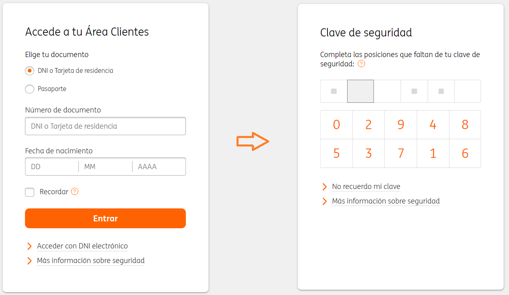
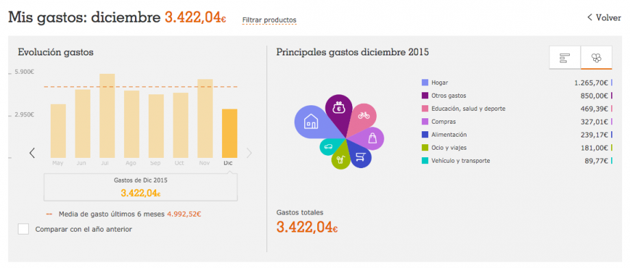
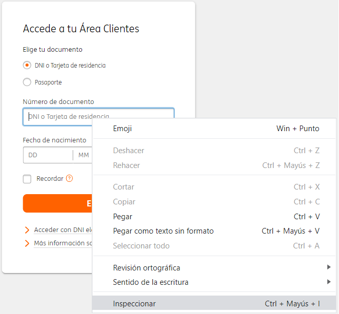
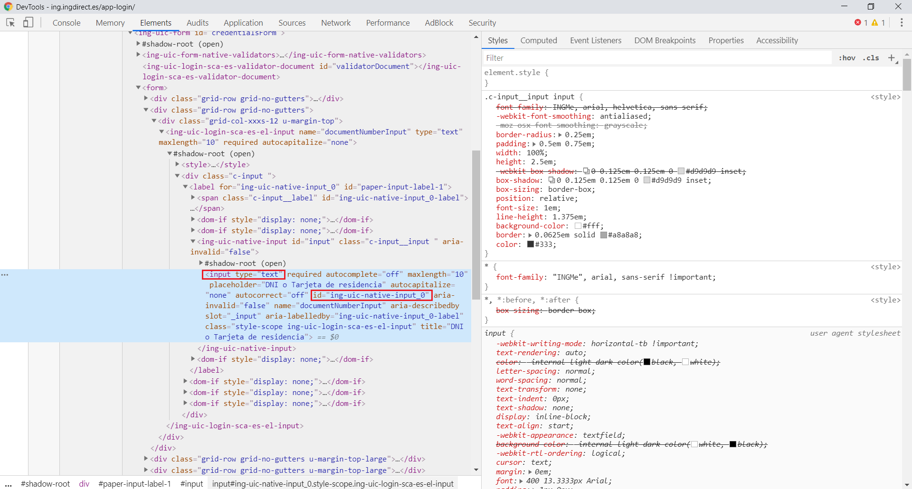
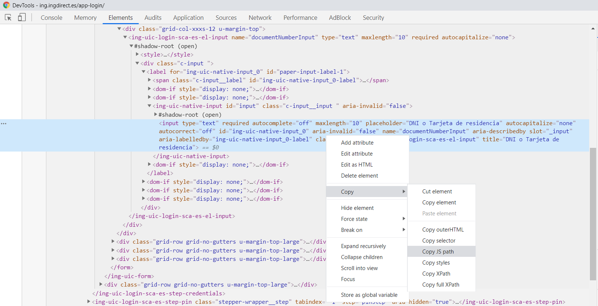

# ING Expenses report

A simple project that login to the Ing website and sends an email report with the current account balance and month expenses.

## Motivación
Hace unos meses empecé a interesarme en lo relativo a la educación financiera con el objetivo de aumentar la capacidad de ahorro y ser más consciente de los gastos diarios.

Después de estar probando excels de presupuestos y aplicaciones varias, decidí utilizar el método propuesto por **YouNeedABudget** que se basa en asignar a cada € un "uso":
sea para la compra en el supermercado, las vacaciones de verano, el coche, el máster, un capricho... 

De esta forma cuando tengamos que hacer un gasto imprevisto, tendremos que retirar ese dinero de alguno de los presupuestos ya realizados y por ende, seremos 
más conscientes de cómo gastamos el dinero.

Si bien la teoría es interesante, a la práctica es un método que requiere mucho tiempo, por lo que decidí enfocarlo de otra forma: 
conocer el gasto actual para corregir las desviaciones y tener un mayor control sobre el dinero disponible.

Por ello, decidí automatizar el proceso de consulta creando un programa que inicia sesión en la web de mi banco (ING) y 
genera un informe de gastos que se envía cada semana por correo. Este informe incluye el total disponible en la cuenta 
y un resumen de lo que he gastado el mes actual, agrupado por categorías.

De esta forma, recibo en mi bandeja de entrada la evolución de mis gastos, sin necesidad de entrar en la web del banco.

A lo largo de este artículo veremos:
- **Cómo funciona el programa:** Cuál es la estructura de la web de ING y cómo conseguir nuestro objetivo utilizando Puppeteer.
- **Qué inconvenientes me he encontrado:** shadowDom, tiempos de espera y enviar el correo utilizando Gmail.
- **Cómo poner todo el sistema en producción de forma óptima:** AWS Lambda, AWS Lambda Layers, CloudWatch Events y unos scripts en bash para publicar el código y gestionar las dependencias.

## Generador del informe
### Proceso paso a paso
Para iniciar sesión en la web de ING y acceder a nuestro área de clientes debemos:
- Login con DNI y fecha de nacimiento
- Introducir tres dígitos concretos de la clave de seguridad, que van cambiando en cada inicio de sesión.




Ya en el dashboard principal, aprovechamos para guardanos el balance actual.


Para entrar detalle de los gastos, sólo teenemos que hacer click en el mes actual de la sección "Mis gastos".
Una vez dentro, realizaremos una captura del gráfico por categorías.



### Show me the code!

Ahora que ya tenemos claro qué información queremos y de dónde conseguirla, pasemos a la acción; pero antes introduciremos los conceptos clave:

#### Puppeteer

En resumen, Puppeteer es una librería para Node.JS que sirve para controlar los navegadores Chrome y Chromium mediante código con lo que podemos automatizar 
todo tipo de acciones y comportamiento tal y como haría un usuario real.

#### DOM, selectores y shadow DOM
Los navegadores se encargan de interpretar el código HTML (estructura de la página web), CSS (estilo) y JS (comportamiento).

Para ello, tenemos que saber que el código HTML que escribimos en forma de etiquetas se interpreta en el navegador 
en forma de árbol (utilizando el estándar Document Object Model, más conocido como DOM) para ser luego renderizado en nuestra pantalla.

Para poder definir el comportamiento de nuestro programa tenemos que saber cómo hacer referencia a los elementos 
con los que tenemos que interactuar: botones, formularios, elementos de texto... Esto lo conseguimos utilizando selectores del DOM, que son los mecanismos 
para seleccionar los elementos HTML de una web.
  
De esta forma, utilizando Puppeteer y el DOM, podremos programar el comportamiento que deseemos.

En este proyecto el primero de nuestros retos es rellenar el formulario de inicio de sesión rellenando la información sobre el DNI y la fecha de nacimiento,
por lo que vamos a inspeccionar el código de la web para conocer la información del formulario:



A continuación veremos mucho código HTML pero si nos centramos en el elemento HTML 
resaltado podemos ver que es un **input** de tipo **text** con un identificador **id="ing-uic-native-input-0"**. 

Con esta información, interactuar con el elemento para introducir nuestro DNI se resume a estas simples líneas de código:
```
    const inputElement = document.getElementById("#ing-uic-native-input-0")
    inputElement.value = "11111111A"
```



Desafortunadamente la realidad no es tan bonita y acceder por el identificador no es tan directo debido a que en esta 
parte de la web de ING Direct utilizan WebComponents. Esta tecnología permite encapsular funcionalidades (HTML, CSS, JS) en forma de 
 componentes con el objetivo de organizar, aislar y reutilizar código y comportamiento de forma más sencilla.
  
Una de las implicaciones que conlleva es que cada componente se crea en un árbol DOM nuevo que luego se incluye en el árbol DOM principal,
y esto provoca que la navegación no sea tan senzilla. Si hacemos click derecho en el elemento que habíamos inspeccionado antes, se desplegará un menú 
que nos permitirá copiar en el portapapeles el código necesario para referenciar al elemento.



El resultado es el mostrado a continuación: una mezcla de selectores y accesos al shadowDom desde el inicio del árbol principal. 

```
    document.querySelector("body > ing-app-login-sca-es")
        .shadowRoot.querySelector("div > div.wrapper-login > ing-orange-login-sca-es")
        .shadowRoot.querySelector("#loginSteps > ing-uic-login-sca-es-step-credentials")
        .shadowRoot.querySelector("#credentialsForm > form > div:nth-child(2) > div > ing-uic-login-sca-es-el-input")
        .shadowRoot.querySelector("#ing-uic-native-input_0")
```

Esto no es ni bonito ni cómodo de gestionar ya que cada vez que cambie la estructura de la página web tendremos que modificar
esta línea de código... ¡Y esto sólo para un único elemento!

Cómo seguramente no soy la primera persona del mundo con este problema, me puse a buscar cómo solucionarlo y encontré la librería 
[query-selector-shadow-dom](https://www.npmjs.com/package/query-selector-shadow-dom), que se encarga de encontrar los elementos sin 
necesitar del camino completo. Tan sólo tenemos que instalar la librería, cargarla en Puppeteer y utilizar las funciones que nos proporcionan.
En el fichero shadow-dom-utils.js encontraréis varias funciones de utilidad que abstraen la lógica de leer y escribir en elementos HTML en el shadow DOM.

... Work in progress ...

- Nodemailer for sending email - gmail unsecure app

### Deploy en AWS
- Deploy to aws
    - Deploy without serverless
    - Dependencies & size limits & lambda layer
    - Schedule with cloudwatch events
    - Bash scripts utils

- References
