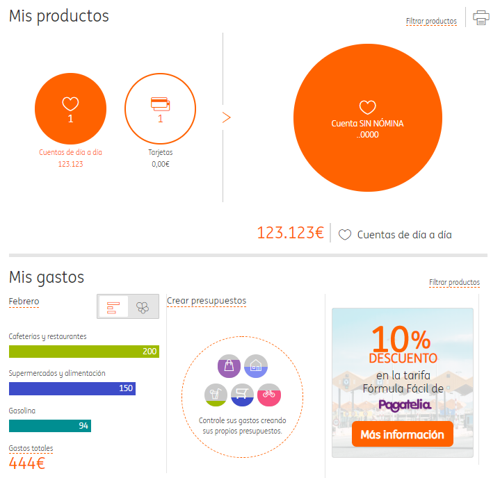

# ING Expenses report

A simple project that login to the Ing website and sends an email report with the current account balance and month expenses.

## Motivación
Hace unos meses empecé a interesarme en lo relativo a la educación financiera con el objetivo de aumentar la capacidad de ahorro y ser más consciente de los gastos diarios.

Después de estar probando excels de presupuestos y aplicaciones varias, decidí utilizar el método propuesto por **YouNeedABudget** que se basa en asignar a cada € un "uso":
sea para la compra en el supermercado, las vacaciones de verano, el coche, el máster, un capricho... 

De esta forma cuando tengamos que hacer un gasto imprevisto, tendremos que retirar ese dinero de alguno de los presupuestos ya realizados y por ende, seremos 
más conscientes de cómo gastamos el dinero.

Si bien la teoría es interesante, a la práctica es un método que requiere mucho tiempo, por lo que decidí enfocarlo de otra forma: 
conocer el gasto actual para corregir las desviaciones y tener un mayor control sobre el dinero disponible.

Por ello, decidí automatizar el proceso de consulta creando un programa que inicia sesión en la web de mi banco (ING) y 
genera un informe de gastos que se envía cada semana por correo. Este informe incluye el total disponible en la cuenta 
y un resumen de lo que he gastado el mes actual, agrupado por categorías.

De esta forma, recibo en mi bandeja de entrada la evolución de mis gastos, sin necesidad de entrar en la web del banco.

A lo largo de este artículo veremos:
- **Cómo funciona el programa:** Cuál es la estructura de la web de ING y cómo conseguir nuestro objetivo utilizando Puppeteer.
- **Qué inconvenientes me he encontrado:** shadowDom, tiempos de espera y enviar el correo utilizando Gmail.
- **Cómo poner todo el sistema en producción de forma óptima:** AWS Lambda, AWS Lambda Layers, CloudWatch Events y unos scripts en bash para publicar el código y gestionar las dependencias.

## Generador del informe
### Proceso paso a paso
Para iniciar sesión en la web de ING y acceder a nuestro área de clientes debemos:
- Login con DNI y fecha de nacimiento
- Introducir tres dígitos concretos de la clave de seguridad, que van cambiando en cada inicio de sesión.

Ya en el dashboard principal, aprovechamos para guardanos el balance actual.

Para entrar detalle de los gastos, sólo teenemos que hacer click en el mes actual de la sección "Mis gastos".
Una vez dentro, realizaremos una captura del gráfico por categorías.

... Work in progress ...
### Show me the code!

Ahora que ya tenemos claro qué información queremos y de dónde conseguirla:

- Puppeteer summary,
- Shadown dom, jspath... and shadowdom library for pupetteer
- Nodemailer for sending email - gmail unsecure app

### Deploy en AWS
- Deploy to aws
    - Deploy without serverless
    - Dependencies & size limits & lambda layer
    - Schedule with cloudwatch events
    - Bash scripts utils

- References
