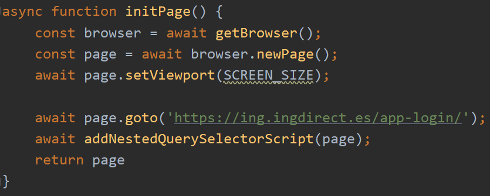

# ING Expenses report

A simple project that login to the Ing website and sends an email report with the current account balance and month expenses.

## Motivación
Hace unos meses empecé a interesarme en lo relativo a la educación financiera con el objetivo de aumentar la capacidad de ahorro y ser más consciente de los gastos diarios.

Después de estar probando excels de presupuestos y aplicaciones varias, decidí utilizar el método propuesto por **YouNeedABudget** que se basa en asignar a cada € un "uso":
sea para la compra en el supermercado, las vacaciones de verano, el coche, el máster, un capricho... 

De esta forma cuando tengamos que hacer un gasto imprevisto, tendremos que retirar ese dinero de alguno de los presupuestos ya realizados y por ende, seremos 
más conscientes de cómo gastamos el dinero.

Si bien la teoría es interesante, a la práctica es un método que requiere mucho tiempo, por lo que decidí enfocarlo de otra forma: 
conocer el gasto actual para corregir las desviaciones y tener un mayor control sobre el dinero disponible.
Por ello, decidí automatizar el proceso de consulta creando un programa que inicia sesión en la web de mi banco (ING) y 
genera un informe de gastos que se envía cada semana por correo. Este informe incluye el total disponible en la cuenta 
y un resumen de lo que he gastado el mes actual, agrupado por categorías.

De esta forma, recibo en mi bandeja de entrada la evolución de mis gastos, sin necesidad de entrar en la web del banco.

A lo largo de este artículo veremos:
- **Cómo funciona el programa:** Cuál es la estructura de la web de ING y cómo conseguir nuestro objetivo utilizando [Puppeteer](https://github.com/puppeteer/puppeteer).
- **Qué inconvenientes me he encontrado:** shadowDom, tiempos de espera y enviar el correo utilizando Gmail.
- **Cómo poner todo el sistema en producción de forma óptima:** AWS Lambda, AWS Lambda Layers, CloudWatch Events y unos scripts en bash para publicar el código y gestionar las dependencias.

## Generador del informe
### Proceso paso a paso
Para iniciar sesión en la web de ING y acceder a nuestro área de clientes debemos:
- Login con DNI y fecha de nacimiento
- Introducir tres dígitos concretos de la clave de seguridad, que van cambiando en cada inicio de sesión.


Ya en el dashboard principal, aprovechamos para guardanos el balance actual.


Para entrar detalle de los gastos tenemos que hacer click en el mes actual, que aparece en la sección "Mis gastos".
Una vez dentro, realizaremos una captura del gráfico por categorías.


### Conceptos clave

Ahora ya tenemos claro qué información queremos y dónde podemos consultarla, pero comentemos los conceptos clave antes de ver el código.

#### Puppeteer

Puppeteer es una librería para Node.JS que sirve para controlar los navegadores Chrome y Chromium mediante código con lo que podemos automatizar 
todo tipo de acciones y comportamiento tal y como haría un usuario real.

#### DOM, selectores y shadow DOM
Los navegadores se encargan de interpretar el código HTML (estructura de la página web), CSS (estilo) y JS (comportamiento).

Para ello, tenemos que saber que el código HTML que escribimos en forma de etiquetas se interpreta en el navegador 
en forma de árbol (utilizando el estándar Document Object Model, más conocido como DOM) para ser luego renderizado en nuestra pantalla.

Para poder definir el comportamiento de nuestro programa tenemos que saber cómo hacer referencia a los elementos 
con los que tenemos que interactuar: botones, formularios, elementos de texto... Esto lo conseguimos utilizando selectores del DOM, que son los mecanismos 
para seleccionar los elementos HTML de una web.
  
De esta forma, utilizando Puppeteer y el DOM, podremos programar el comportamiento que deseemos.

En este proyecto el primero paso es rellenar el formulario de inicio de sesión rellenando la información sobre el DNI y la fecha de nacimiento,
por lo que vamos a inspeccionar el código de la web para conocer la información del formulario:


A continuación veremos mucho código HTML pero si nos centramos en el elemento HTML 
resaltado podemos ver que es un **input** de tipo **text** con un identificador **id="ing-uic-native-input-0"**. 

Con esta información, interactuar con el elemento para introducir nuestro DNI se resume a estas simples líneas de código:
```
    const inputElement = document.getElementById("#ing-uic-native-input-0")
    inputElement.value = "11111111A"
```


Desafortunadamente la realidad no es tan simple, pues acceder por el identificador no es tan directo debido a que esta 
parte de la web de ING Direct está programada con Polymer y por tanto, utiliza WebComponents. Esta tecnología permite encapsular funcionalidades (HTML, CSS, JS) en forma de 
 componentes con el objetivo de organizar, aislar y reutilizar código y comportamiento de forma más sencilla.
  
Una de las implicaciones que conlleva es que cada componente se crea en un árbol DOM nuevo que luego se incluye en el árbol DOM principal,
y esto conlleva que la navegación no sea tan senzilla. Si hacemos click derecho en el elemento que habíamos inspeccionado antes, se desplegará un menú 
que nos permitirá copiar en el portapapeles el código necesario para referenciar al elemento.


El resultado es el mostrado a continuación: una mezcla de selectores y accesos al shadowDom desde el inicio del árbol principal. 

```
    document.querySelector("body > ing-app-login-sca-es")
        .shadowRoot.querySelector("div > div.wrapper-login > ing-orange-login-sca-es")
        .shadowRoot.querySelector("#loginSteps > ing-uic-login-sca-es-step-credentials")
        .shadowRoot.querySelector("#credentialsForm > form > div:nth-child(2) > div > ing-uic-login-sca-es-el-input")
        .shadowRoot.querySelector("#ing-uic-native-input_0")
```

Como es de suponer, esto no es ágil ni cómodo de gestionar dado que cada vez que cambie la estructura de la página web tendremos que modificar
esta línea de código... ¡Y esto sólo para un único elemento!

Cómo seguramente no soy la primera persona del mundo con este problema, me puse a buscar cómo solucionarlo y encontré la librería 
[query-selector-shadow-dom](https://www.npmjs.com/package/query-selector-shadow-dom) que se encarga de encontrar los elementos sin 
necesidad de especificar el camino completo. Tan sólo tenemos que instalar la librería, cargarla en Puppeteer y utilizar las funciones que nos proporcionan.
En el fichero [shadow-dom-utils.js](./lib/utils/shadow-dom-utils.js) encontraréis varias funciones de utilidad que abstraen la lógica de leer y escribir en elementos HTML en el shadow DOM.

A partir de aquí empezamos a desgranar el código y a comentar las diferentes fases que hemos introducido anteriormente:

### Show me the code!
La función principal es **ingReport**, que realiza todas las acciones necesarias para llevar a cabo el proceso. Es prácticamente autoexplicativa 
por lo que nos centraremos en comentar cada una de las funciones internas que la forman.


### Inicialización: La función initPage
El inicio del proceso es sencillo y es prácticamente el mismo para todos los scripts con Puppeteer: iniciar el navegador, crear una nueva página 
página del tamaño que queramos y cargar la URL que nos interesa. 



La clave de esta función, está en cargar la librería que necesitaremos para consultar los elementos del Shadow DOM para tenerla disponible 
cuando sea necesario. Es importante cargarla una vez estemos en la URL que nos interesa para las funciones que nos proporciona sean accesibles.

Como hemos instalado la librería con NPM, la encontraremos en la carpeta node_modules del proyecto. Concretamente, la instrucción 
para cargarla en el navegador es:
```
    page.addScriptTag({path: path.join(process.cwd(), 'node_modules/query-selector-shadow-dom/dist/querySelectorShadowDom.js')});
```

A partir de aquí ya tenemos nuestra página inicializada y correctamente configurada. Hay que tener cuidado ya que si a lo largo del proceso
decidiéramos navegar a otra URL tendríamos que cargar otra vez el script.

### Login: La función doLogin
Ahora ya estamos frente al formulario de login en el que tenemos que insertar nuestros datos personales y pulsar el botón de "Entrar".
Para ello, utilizamos las funciones de utilidad que comentaba anteriormente. Como podéis ver el código sigue siendo autoexplicativo a 
excepción de la primera línea, dónde esperamos tres segundos para asegurarnos que la web ha acabado de cargar. Idealmente, esto lo haríamos
con alguno de los métodos que proporciona Puppeteer, pero debido al shadow dom, el resultado no es tan elegante como cabría esperar. 
Por ello, decido utilizar esta técnica, que si bien no es la más eficiente, es la que más legibilidad proporciona.

Como la seguridad es uno de los aspectos más importantes a tener en cuenta, y tampoco quiero compartir mis datos bancarios con todo el mundo
las variables referentes a la información personal, se definen utilizando variables de entorno, por lo que no están en el código 
y no son accesibles a terceras personas. Más adelante explicaremos cómo hacerlo. 


### Código de seguridad: La función fillSecurityCode
Este quizás es uno de los puntos más interesantes del proyecto ya que parece la medida estrella en múltiples plataformas:
introducir unos dígitos concretos de una clave que sólo sabemos nosotros y que van cambiando en cada intento. Además, en este caso, tenemos 
que utilizar el teclado que nos proporciona ING, que también va cambiando.

Si planteamos este proceso de la misma forma que lo haríamos cuando queremos entrar utilizando la aplicación llegaríamos al siguiente algoritmo:
- Conocer qué posiciones de nuestra clave nos están pidiendo
- Para cada posición, pensar en el dígito equivalente de nuestro clave.
- Buscar el dígito en el teclado y pulsarlo.

Aunque parece una tontería, el reto reside en cómo adivinamos qué posiciones nos piden y, una vez tenemos los dígitos, cómo los encontramos en el teclado.

Desglosemos el código paso a paso:

#### Conocer las posiciones
Para saber qué posiciones tenemos que rellenar, vamos a inspeccionar el código HTML para ver si tenemos alguna pista y... Bingo! Resulta que hay un texto 
oculto que nos indica exactamente qué posiciones rellenar.


#### Conseguir el código para cada posición
Pongamos, por ejemplo, que nuestro código de seguridad es el 987654: si nos piden las posiciones 4,5 y 6 tan sólo tenemos que ir a a nuestra clave y buscar el dígito correspondiente.
Como en la mayoría de lenguajes, en JavaScript las posiciones empiezan en el índice 0 así que en este caso tendríamos que acceder a las casillas 3,4 y 5.
Como ya conocemos la clave de antemano, es trivial quedarnos con los dígitos "6", "5" y "4" de nuestra clave.

#### Pulsar los botones adecuados
Ahora, ya solo nos queda encontrar la posición de cada botón para pulsar el número correcto. Para ello inspeccionamos 
el código otra vez y tal y como podemos observar, para cada dígito posible tenemos un "slot" que indica qué posición es en el teclado.

Así, la clave número 2 está en el slot número 1, la clave 1 en el dos y así sucesivamente. Por tanto, tenemos que buscar qué "slots" 
corresponden a cada número para luego pulsarlos. En este caso, tenemos que pulsar los slots 4, 7 y 8 que corresponden a los dígitos 
6, 5 y 4 que nos han solicitado.


En la función **fillSecurityCode** está la lógica que realiza este paso. Una vez ejecutado, ya hemos completado la fase de login y pasamos al dashboard principal de la web.
 
**IMPORTANTE:** Cómo comentaba anteriormente sólo la parte del login está hecha con el framework Polymer, pero no el dashboard principal por lo que no tenemos que 
preocuparnos por el shadow DOM y en consecuencia, el acceso a los elementos se vuelve más directo.


### Aceptar las cookies: La función acceptCookies
Como viene siendo habitual en todas las páginas web siempre que entramos tenemos la obligación de configurar nuestras preferencias 
en cuanto a las cookies se refiere, y en este caso no iba a ser diferente. Para ello, sólo debemos hacer click en el botón de aceptar:

```
async function acceptCookies(page) {
    await page.waitFor(15000);
    await page.click('#aceptar');
}
```


#### Conseguir el saldo actual: La función getCurrentBalance
Antes de llegar al apartado del informe aprovechamos para guardarnos el saldo actual de nuestras cuentas:

```
async function getCurrentBalance(page) {
    const element = await page.$('p.h1.clr-dark-orange.amount');
    return (await page.evaluate(element => element.textContent, element))
}
```

#### Captura de pantalla de los gastos: La función generateReportExpensesReport


### Documentation TODOs
- [ ] Nodemailer for sending email - gmail unsecure app
- [ ] Deploy to aws
- [ ] Deploy without serverless
- [ ] Dependencies & size limits & lambda layer
- [ ] Schedule with cloudwatch events
- [ ] Bash scripts utils


### Project TODOs
- [ ] Enviar un informe más completo a cierre del mes

### Referencias
- [GitHub - Better support for Shadow DOM](https://github.com/puppeteer/puppeteer/issues/4171)
- [GitHub - Querying nodes within shadow roots](https://github.com/puppeteer/puppeteer/issues/858)
